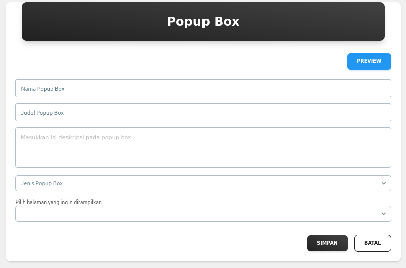
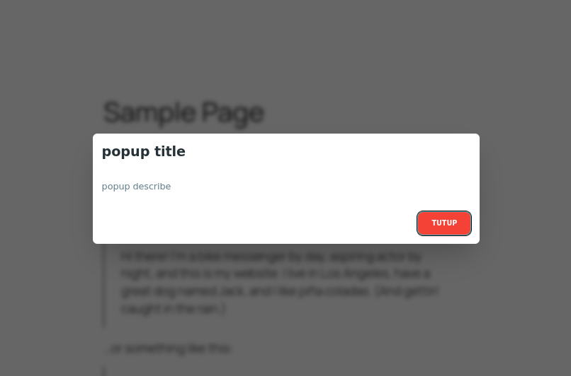
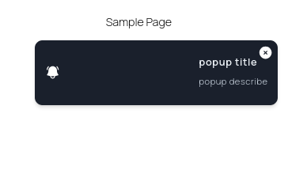

# Custom Post Type Popup Box with React JS

The Popup Box plugin is a WordPress plugin built using React.js to create and manage customizable popup boxes with a modern and interactive UI. It leverages Custom Post Type (CPT) for popup management, allowing users to create, edit, and display popups easily from the WordPress dashboard.

## Key Features
- Custom Post Type for Popups – Manage popups like regular posts with full WordPress support.
- React.js-Based UI – Ensures a smooth and dynamic popup experience.
- API Integration – Supports REST API to fetch and manage popups externally.
- Trigger & Display Rules – Control when and where popups appear (on page load, exit intent, button click, etc.).
- Advanced Customization – Modify popup content, styles, and animations through settings.

## Views
    - Admin

  
  

    - Popup

  
  

## 🚀 Installation

- Change directory `cd {MyPlugin}`
- Install dependencies `npm install`
- Build assets `npx grunt or grunt` (if grunt is undefined then do `npm install -g grunt`)
  assets build in default folder `{assets/src/.dist}`
- Composer update `composer update`
- Composer dump autoload `composer dump-autoload`
- Activate the plugin in WordPress

## 📝 Documentations
- [DOCS.md](https://github.com/codinersmillenium/react-popup-box/blob/main/docs/DOCS.md)
- [README.md](https://github.com/codinersmillenium/react-popup-box/blob/main/README.md)
- [API](https://github.com/codinersmillenium/react-popup-box/blob/main/docs/DOCS_API.json)

## 🎉 Credits

This plugin is heavily using these free & open-source libraries
all the credits go to these peoples and communities
who had helped provide and develop these libraries
- [@material-tailwind/react](https://www.material-tailwind.com/)
- [react](https://react.dev/)
- [heroicons/react](https://heroicons.com/)
