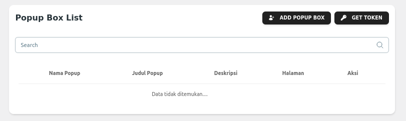

# Custom Post Type Popup Box React JS

React Popup Plugin for WordPress is a powerful and customizable plugin that integrates React.js with WordPress to display dynamic popup boxes on your site. This plugin allows you to easily add, configure, and manage popups, whether it's for notifications, announcements, contact forms, or promotional offers, all with the flexibility and performance of React.

## 📝 Documentations
1. Points.
    - OOP (Object Oriented Programming)
        - MVC (Model View Controller).
        - App developement in `{ /app }`
            1. app/Controllers/
                - PopupAdmin.php → Controller handling backend logic in the WordPress admin panel.
                - PopupBox.php → Main controller managing popup display logic.
            2. app/Core/
                - Abstract/ → Contains abstract classes that can be extended by other components.
                - Exceptions/ → Stores custom exceptions used in the plugin.
                - Interfaces/ → Collection of interfaces to define code contracts.
                - Traits/ → Contains reusable traits for code optimization.
                Routes.php → Main file handling the plugin’s routing system.
            3. app/Http/
                - Middleware/ → Middleware to process requests before reaching controllers.
                - Routes/ → Routing configuration that maps requests to controllers.
            4. app/Models/
                - PopupBoxModel.php → Model handling database interactions for popups.
            5. app/Services/Api/v1/
                - API_PopupBox.php → API endpoint for version 1 (v1) of the popup service.
                - To update the secret key in generating JWT tokens, you can use Composer, with the command `composer secret-key`
            6. app/Views/
                popup-template.php → Template file used for rendering the popup via React.js.
            7. Config.php
                Global configuration file for the plugin.
            8. Helper.php
                Contains helper functions that can be used throughout the plugin.

    - WordPress
        - Employ WordPress CPT (Custom Post Types) and Custom Fields without external plugin assistance in `{ app/Controllers/PopupAdmin }` to register CPT (init hooks)

    - Design & Implementation
        - Utilize SASS for designing the plugin in `{ /assets/scss/ }`.
        - Use react js in `{ assets/src }`.

2. Features.
    ✔ MVC-based structure for clear separation of business logic, views, and models.
    ✔ React.js integration for a modern and interactive popup UI.
    ✔ Composer autoloading for efficient dependency management and automatic class loading.
    ✔ Custom routing for structured request handling.
    ✔ Middleware support for request filtering and access control.
    ✔ API versioning (v1, v2, etc.) for scalable future development.
    ✔ Global helpers & configuration for modular and easily configurable settings.
    ✔ Title, saves the value of the pop up title that will be displayed.
    ✔ Description or Content, saves the value of the pop up description that will be displayed.
    ✔ Popup Box Setting.
        - `Popup Name `: Initialize popup name.
        - `Popup Title `: Initialize popup name.
        - `Popup Content `: Initialize popup name.
        - `Popup Type `: Choose the type of the popup to display (toast or modal dialog).
        - `Popup Showpage `: Select the page on which to display the popup.
        - `Popup Enable `: Enable popup, show or hide popup.

3. Integration API in `wp-json/artistudio/v1`.
    Generate JWT token auth for development from dashboard
    

        
    
